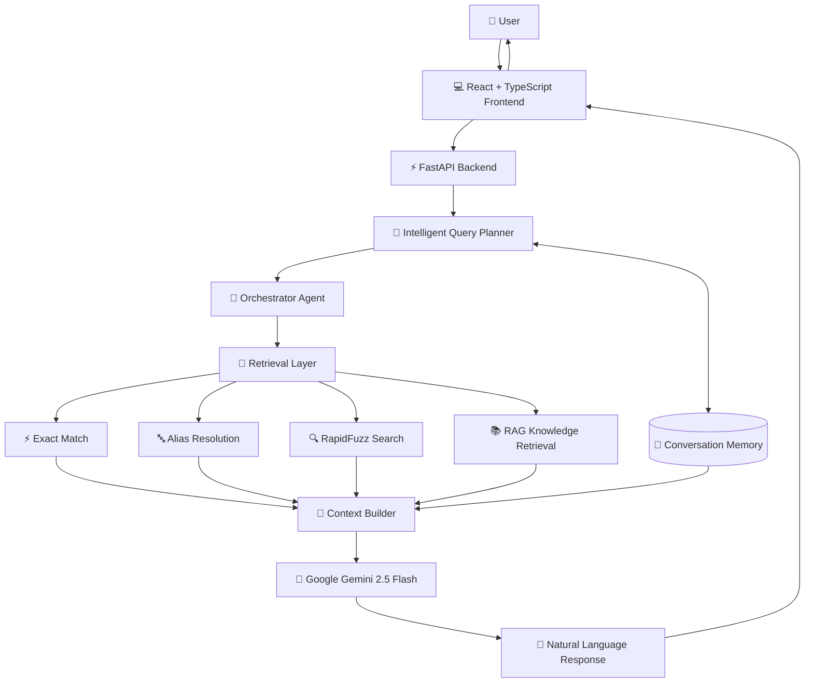
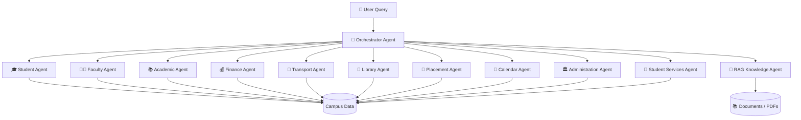
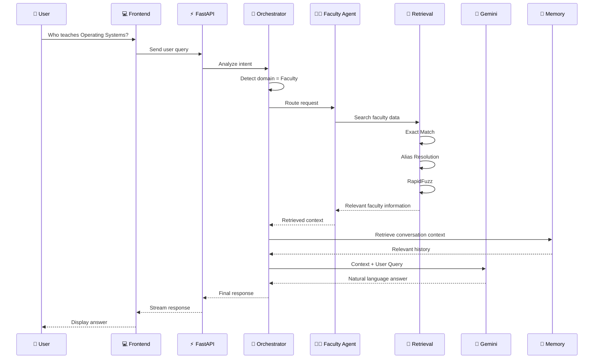
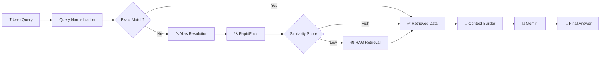
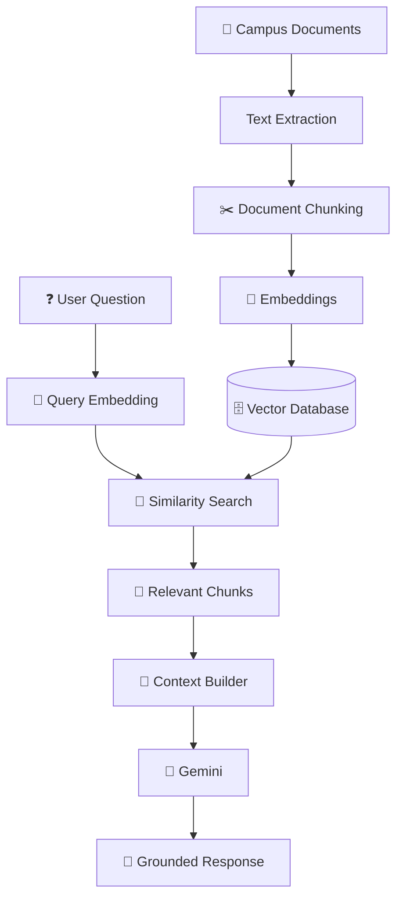
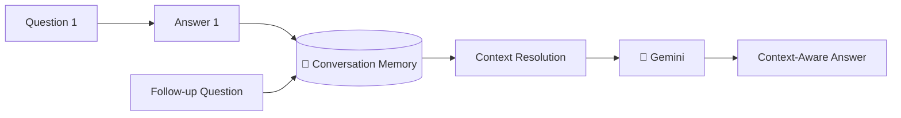
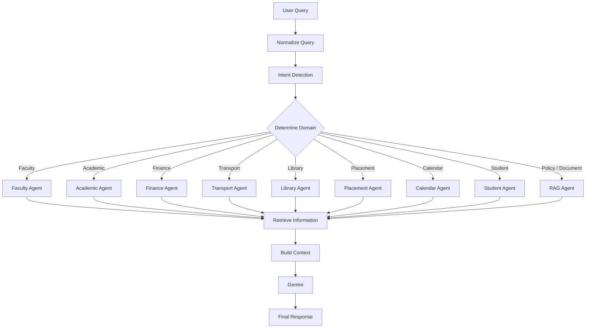
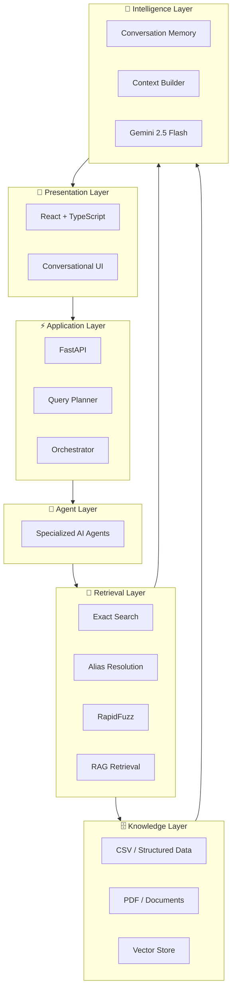
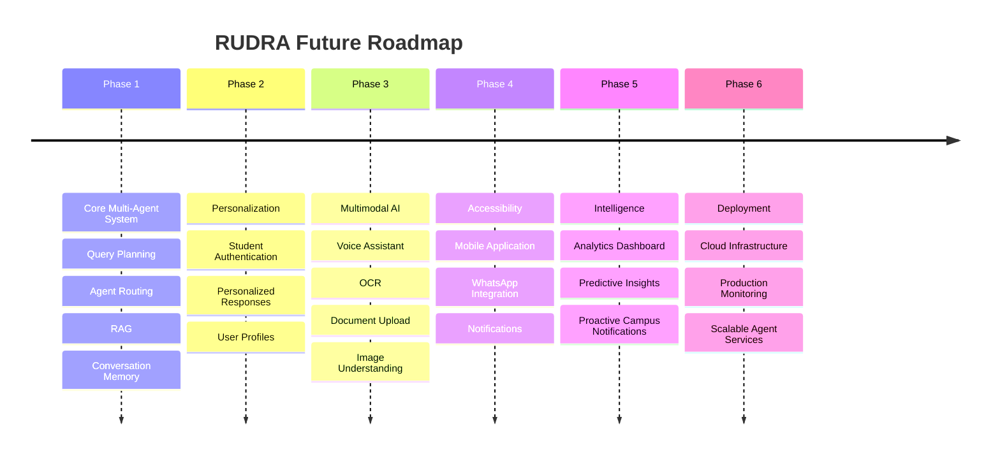

# 🧠 RUDRA — AI-Powered Smart Campus Assistant

<p align="center">

**Responsive Unified Digital Resource Assistant**

An intelligent, multi-agent AI assistant that gives students, faculty, and administrators **instant, accurate, and context-aware access to campus information through a single conversational interface.**

<br/>


</p>

---

## 🌟 What is RUDRA?

Modern campuses contain information across **websites, PDFs, spreadsheets, notices, academic records, policies, and departmental systems**.

Students often need to search through multiple sources just to answer a simple question.

### ❌ Traditional Approach

```text
Student
   │
   ├── College Website
   ├── PDF Documents
   ├── Notices
   ├── Excel / CSV Files
   ├── Department Pages
   └── Multiple Portals
```

### ✅ RUDRA Approach

```text
                         ┌─────────────────────┐
                         │       USER          │
                         │ Student / Faculty   │
                         │ / Administration    │
                         └──────────┬──────────┘
                                    │
                                    ▼
                         ┌─────────────────────┐
                         │       RUDRA         │
                         │ Conversational AI   │
                         └──────────┬──────────┘
                                    │
                                    ▼
                         ┌─────────────────────┐
                         │ Intelligent Planner │
                         │ & Orchestrator      │
                         └──────────┬──────────┘
                                    │
                    ┌───────────────┼───────────────┐
                    ▼               ▼               ▼
               Structured        RAG / Docs      Memory
                 Data             Search         Context
                    │               │               │
                    └───────────────┼───────────────┘
                                    ▼
                         ┌─────────────────────┐
                         │ Google Gemini 2.5   │
                         │       Flash        │
                         └──────────┬──────────┘
                                    │
                                    ▼
                         ┌─────────────────────┐
                         │ Context-Aware       │
                         │ Natural Response    │
                         └─────────────────────┘
```

> **One interface. Multiple campus services. One intelligent assistant.**

---

# 🎯 Problem Statement

Campus information is fragmented across different sources and systems.

Students and faculty frequently face problems such as:

* 🔎 Difficulty finding the correct information
* 📄 Searching through lengthy PDFs and documents
* 🗂️ Information distributed across multiple departments
* ⏱️ Time wasted navigating different portals
* ❓ Difficulty understanding policies and procedures
* 🔄 Repeatedly asking staff the same questions
* 🧩 Lack of personalized, context-aware responses

### RUDRA solves this by providing a unified conversational interface for campus information.

---

# 💡 Proposed Solution

RUDRA combines:

* 🤖 **Multi-Agent AI**
* 🧠 **Intelligent Query Planning**
* 📚 **Retrieval-Augmented Generation (RAG)**
* 🔍 **Hybrid Information Retrieval**
* 💬 **Conversation Memory**
* ⚡ **Fast structured-data lookup**
* 🧩 **Context-aware response generation**

The system determines **what the user is asking, which information source is required, which specialized agent should handle it, and how the final answer should be generated.**

---

# 🏗️ System Architecture



---

# 🤖 Multi-Agent Architecture

RUDRA follows a **specialized-agent architecture**, where each agent focuses on a particular campus domain.



---

# 🧩 AI Agents

| Agent                         | Responsibility                                        |
| ----------------------------- | ----------------------------------------------------- |
| 🎓 **Student Agent**          | Student-related information and services              |
| 👨‍🏫 **Faculty Agent**       | Faculty directory, subjects and schedules             |
| 📚 **Academic Agent**         | Courses, subjects, academic information               |
| 💰 **Finance Agent**          | Fees and finance-related information                  |
| 🚌 **Transport Agent**        | Bus routes, stops and transport information           |
| 📖 **Library Agent**          | Library timings, services and resources               |
| 💼 **Placement Agent**        | Placement information and eligibility                 |
| 📅 **Calendar Agent**         | Academic calendar and important dates                 |
| 🏛️ **Administration Agent**  | Administrative information                            |
| 🎯 **Student Services Agent** | Campus/student support services                       |
| 📄 **RAG Knowledge Agent**    | Document and policy-based question answering          |
| 🧠 **Orchestrator Agent**     | Understands intent and coordinates specialized agents |

---

# 🔄 End-to-End Query Flow

Suppose a student asks:

> **"Who teaches Operating Systems?"**

RUDRA processes the request through multiple stages.



---

# 🔎 Hybrid Retrieval System

RUDRA does not rely solely on an LLM to find information.

Instead, it combines **deterministic retrieval techniques with generative AI**.



### Why this approach?

| Technique            | Purpose                                             |
| -------------------- | --------------------------------------------------- |
| **Exact Match**      | Fast and deterministic retrieval                    |
| **Alias Resolution** | Handles abbreviations and alternate names           |
| **RapidFuzz**        | Handles spelling variations and approximate queries |
| **RAG**              | Retrieves information from documents                |
| **Gemini**           | Converts retrieved context into natural language    |

This reduces unnecessary LLM reasoning and improves **speed, grounding, and reliability**.

---

# 📚 RAG Pipeline

For policies, handbooks, notices, and other unstructured documents, RUDRA uses Retrieval-Augmented Generation.



### RAG in RUDRA

```text
Documents
   ↓
Text Extraction
   ↓
Chunking
   ↓
Embeddings
   ↓
Vector Storage
   ↓
Semantic Retrieval
   ↓
Relevant Context
   ↓
Gemini
   ↓
Grounded Answer
```

> RAG allows RUDRA to answer questions from campus documents without expecting the LLM to memorize the entire knowledge base.

---

# 🧠 Conversation Memory

RUDRA maintains relevant conversational context to support follow-up questions.

### Example

```text
User:
Who teaches Operating Systems?

RUDRA:
Dr. XYZ teaches Operating Systems.

User:
What is their qualification?

RUDRA:
Dr. XYZ holds a Ph.D. in Computer Science.
```

The second query can use the context established by the first interaction.



---

# ⚡ Intelligent Query Planning

The Query Planner determines how the request should be processed.



---

# 🎯 Example Use Cases

## 👨‍🏫 Faculty

```text
"Who teaches Operating Systems?"
"Show the faculty handling Data Structures."
"Who is the HOD of CSE?"
```

## 🎓 Students

```text
"Show my attendance."
"What subjects do I have today?"
"Where can I find my academic information?"
```

## 💰 Finance

```text
"What is the tuition fee?"
"Show my fee details."
"What are the payment deadlines?"
```

## 🚌 Transport

```text
"Which buses pass through Karmanghat?"
"What is the route for Bus 12?"
"Where is the nearest bus stop?"
```

## 💼 Placements

```text
"Am I eligible for placements?"
"What are the placement requirements?"
"Which companies are visiting?"
```

## 📖 Library

```text
"What are the library timings?"
"How can I access library resources?"
"What are the library rules?"
```

## 📅 Academic

```text
"When are the semester exams?"
"Explain the attendance policy."
"When does the semester begin?"
```

---

# 🛠️ Technology Stack

## Frontend

| Technology      | Purpose                        |
| --------------- | ------------------------------ |
| ⚛️ React        | UI development                 |
| 📘 TypeScript   | Type-safe frontend development |
| ⚡ Vite          | Development and build tooling  |
| 🎨 Tailwind CSS | Styling                        |
| 🧩 shadcn/ui    | Reusable UI components         |

## Backend

| Technology   | Purpose                       |
| ------------ | ----------------------------- |
| 🐍 Python    | Core backend language         |
| ⚡ FastAPI    | REST API and backend services |
| 🐼 Pandas    | Structured data processing    |
| 🔤 RapidFuzz | Fuzzy matching                |
| ⚙️ AsyncIO   | Asynchronous processing       |

## AI Layer

| Technology                  | Purpose                            |
| --------------------------- | ---------------------------------- |
| 🤖 Google Gemini 2.5 Flash  | Response generation                |
| 🧠 Multi-Agent Architecture | Domain specialization              |
| 📚 RAG                      | Document-based knowledge retrieval |
| 🔎 Hybrid Retrieval         | Accurate information lookup        |
| 🧠 Conversation Memory      | Context-aware conversations        |

---

# 🏛️ Layered Architecture



---

# 📂 Project Structure

```text
RUDRA/
│
├── Backend/
│   ├── app/
│   │   ├── main.py
│   │   └── ...
│   │
│   ├── agents/
│   │   ├── student_agent/
│   │   ├── faculty_agent/
│   │   ├── academic_agent/
│   │   ├── finance_agent/
│   │   ├── transport_agent/
│   │   ├── library_agent/
│   │   ├── placement_agent/
│   │   ├── calendar_agent/
│   │   ├── administration_agent/
│   │   ├── student_services_agent/
│   │   └── rag_agent/
│   │
│   ├── orchestrator/
│   ├── services/
│   ├── memory/
│   ├── tests/
│   ├── requirements.txt
│   └── .env
│
├── Frontend/
│   └── RUDRA-FRONTEND/
│       ├── src/
│       ├── public/
│       ├── package.json
│       └── ...
│
├── AI-AGENTS/
│   ├── Student_Agent/
│   ├── Faculty_Agent/
│   ├── Academic_Agent/
│   ├── Transport_Agent/
│   ├── Finance_Agent/
│   ├── Library_Agent/
│   ├── Placement_Agent/
│   ├── RAG_Agent/
│   └── ...
│
└── README.md
```

---

# 🔄 Request Lifecycle

```text
┌───────────────────────────────────────────────────────┐
│                     USER QUERY                        │
└──────────────────────────┬────────────────────────────┘
                           ↓
┌───────────────────────────────────────────────────────┐
│                  QUERY NORMALIZATION                  │
└──────────────────────────┬────────────────────────────┘
                           ↓
┌───────────────────────────────────────────────────────┐
│              INTENT + DOMAIN DETECTION                │
└──────────────────────────┬────────────────────────────┘
                           ↓
┌───────────────────────────────────────────────────────┐
│                 ORCHESTRATOR AGENT                    │
└──────────────────────────┬────────────────────────────┘
                           ↓
                  ┌────────┴────────┐
                  ↓                 ↓
          Structured Data        Documents
                  ↓                 ↓
          Exact / Fuzzy           RAG
             Search             Retrieval
                  └────────┬────────┘
                           ↓
┌───────────────────────────────────────────────────────┐
│                    CONTEXT BUILDER                    │
└──────────────────────────┬────────────────────────────┘
                           ↓
┌───────────────────────────────────────────────────────┐
│                GEMINI 2.5 FLASH                       │
└──────────────────────────┬────────────────────────────┘
                           ↓
┌───────────────────────────────────────────────────────┐
│              CONTEXT-AWARE RESPONSE                   │
└───────────────────────────────────────────────────────┘
```

---

# 🔐 Security & Reliability

RUDRA is designed with backend security and response reliability in mind.

### 🔒 Security

* Environment-based API key management
* `.env` excluded from version control
* Backend-controlled access to AI services
* Input validation through FastAPI
* Separation of frontend and backend responsibilities

### 🎯 Reliability

* Deterministic exact-match retrieval
* Alias resolution
* Fuzzy matching
* RAG grounding
* Context-aware generation
* Agent specialization
* Automated testing

---

# 📊 Why Multi-Agent AI?

A single general-purpose LLM can answer questions, but it does not provide the same level of **domain separation, controllability, and extensibility**.

### Traditional Single-Agent Approach

```text
User
 ↓
One LLM
 ↓
Generic Answer
```

### RUDRA Multi-Agent Approach

```text
                         User
                           │
                           ▼
                    Orchestrator
                           │
          ┌────────────────┼────────────────┐
          ↓                ↓                ↓
     Academic          Finance          Transport
       Agent             Agent             Agent
          ↓                ↓                ↓
       Academic          Fee              Bus
        Data             Data            Data
          └────────────────┼────────────────┘
                           ↓
                    Context Builder
                           ↓
                       Gemini
                           ↓
                    Final Answer
```

### Benefits

* 🎯 Domain-specific reasoning
* 🧩 Modular architecture
* 🔄 Easier maintenance
* 📈 Scalable to additional services
* 🔐 Better control over data access
* 🧪 Easier testing
* ⚡ Efficient query routing

---

# 🌟 Key Features

* 🤖 **12-Agent Multi-Agent Architecture**
* 🧠 **Intelligent Query Planning**
* 📚 **Retrieval-Augmented Generation**
* 🔎 **Hybrid Search**
* ⚡ **Exact Match Retrieval**
* 🔤 **Alias Resolution**
* 🔍 **RapidFuzz Similarity Search**
* 🧠 **Conversation Memory**
* 🧩 **Context Builder**
* 🌐 **Streaming AI Responses**
* 💬 **Natural Language Interface**
* 🔒 **Secure Backend Architecture**
* 📊 **Structured + Unstructured Data Support**
* 🧪 **Testing and Validation**

---

# 🚀 Installation

## 1. Clone the Repository

```bash
git clone https://github.com/Hrithik-ui753/Rudra.git

cd Rudra
```

---

## 2. Backend Setup

```bash
cd Backend

pip install -r requirements.txt
```

Start the FastAPI server:

```bash
uvicorn app.main:app --reload
```

Backend:

```text
http://localhost:8000
```

---

## 3. Frontend Setup

Open a new terminal:

```bash
cd Frontend/RUDRA-FRONTEND

npm install

npm run dev
```

Frontend:

```text
http://localhost:5173
```

---

# 🔑 Environment Variables

Create a `.env` file inside the `Backend` directory.

```env
GEMINI_API_KEY=YOUR_GEMINI_API_KEY
```

> ⚠️ **Never commit API keys or `.env` files to GitHub.**

Recommended `.gitignore`:

```gitignore
.env
__pycache__/
*.pyc
node_modules/
dist/
```

---

# 🧪 Testing

RUDRA includes backend testing for critical components such as:

```text
API Endpoints
     ↓
Agent Routing
     ↓
Retrieval
     ↓
Fuzzy Matching
     ↓
RAG
     ↓
Memory
     ↓
Response Generation
```

Run backend tests with:

```bash
pytest
```

---

# 📸 Demo Scenarios

### Scenario 1 — Faculty Search

```text
👤 User:
Who teaches Operating Systems?

🤖 RUDRA:
Operating Systems is handled by Dr. ______.
```

### Scenario 2 — Transport

```text
👤 User:
Which buses pass through Karmanghat?

🤖 RUDRA:
The following campus buses serve routes passing
through Karmanghat: ______.
```

### Scenario 3 — Policy Question

```text
👤 User:
Explain the attendance policy.

🤖 RUDRA:
According to the retrieved academic policy...
```

### Scenario 4 — Contextual Follow-up

```text
👤 User:
Who teaches Operating Systems?

🤖 RUDRA:
Dr. XYZ teaches Operating Systems.

👤 User:
What is their qualification?

🤖 RUDRA:
Dr. XYZ holds a Ph.D. in Computer Science.
```

---

# 🚀 Future Roadmap



### Planned Improvements

* 🎙️ Voice Assistant
* 📱 Mobile Application
* 📄 OCR-based Document Upload
* 💬 WhatsApp Integration
* 🔐 Student Authentication
* 📊 Analytics Dashboard
* 🔔 Notification System
* ☁️ Cloud Deployment
* 🤝 More specialized agents
* 🧠 Advanced personalization

---

# 🏆 Impact

## For Students

* ⚡ Faster access to information
* 🔎 Less manual searching
* 💬 Natural-language interaction
* 🧠 Context-aware conversations
* 📚 Centralized campus knowledge

## For Faculty

* 📋 Easier access to academic information
* 🗂️ Reduced repetitive queries
* ⚡ Faster information retrieval

## For Administration

* 📉 Reduced support workload
* 📊 Better information accessibility
* 🧩 Centralized campus knowledge system

## For the Institution

* 🚀 Digital transformation
* 🤖 AI-powered campus services
* 📈 Scalable architecture
* 🌐 Unified information access

---

# 💎 What Makes RUDRA Different?

RUDRA is more than a chatbot.

```text
                 CHATBOT
                    │
          ┌─────────┴─────────┐
          ↓                   ↓
       LLM Only          Generic FAQ
          │
          │
          ▼
        RUDRA
          │
   ┌──────┼──────┐
   ↓      ↓      ↓
 Agents   RAG   Memory
   │      │      │
   └──────┼──────┘
          ↓
    Query Planning
          ↓
   Hybrid Retrieval
          ↓
   Context Building
          ↓
   Grounded Response
```

### RUDRA combines:

> **Multi-Agent Intelligence + RAG + Hybrid Retrieval + Conversation Memory + Structured Campus Data**

into one unified campus assistant.

---

# 👥 Team

Developed as part of a **Smart Campus AI Hackathon Project**.

### Team RUDRA

> Building intelligent, accessible, and scalable AI solutions for smarter campuses.

---

# 📄 License

This project is developed for **educational and hackathon purposes**.

---

# ⭐ Support the Project

If you found RUDRA useful or interesting, consider giving the repository a ⭐ on GitHub.

---

<div align="center">

## 🧠 RUDRA

### **Making Campus Information Smarter, Faster, and More Accessible with AI.**

**Ask. Retrieve. Understand. Respond.**

</div>
